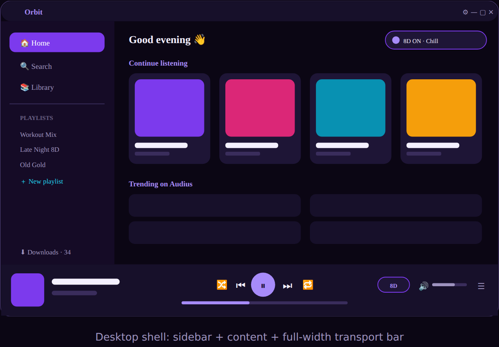
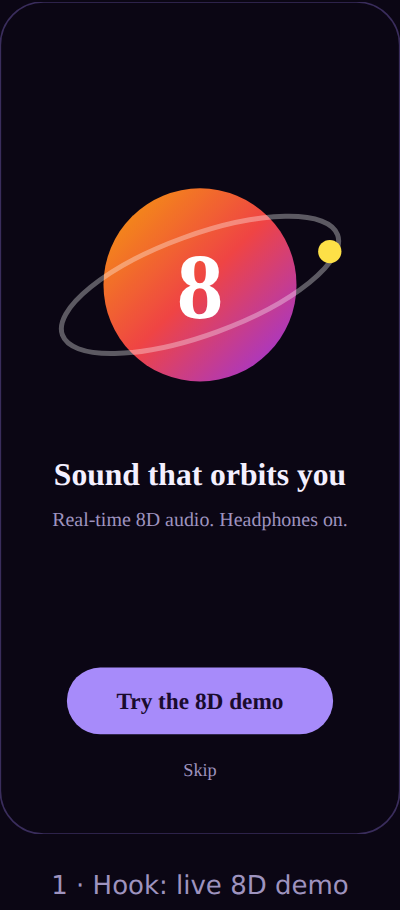
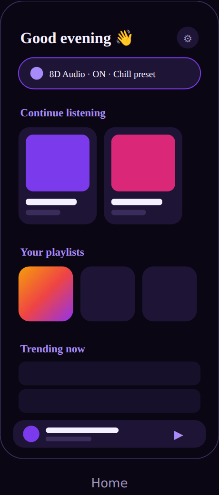
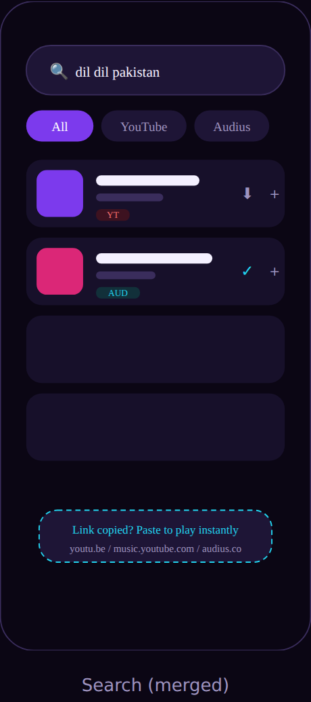
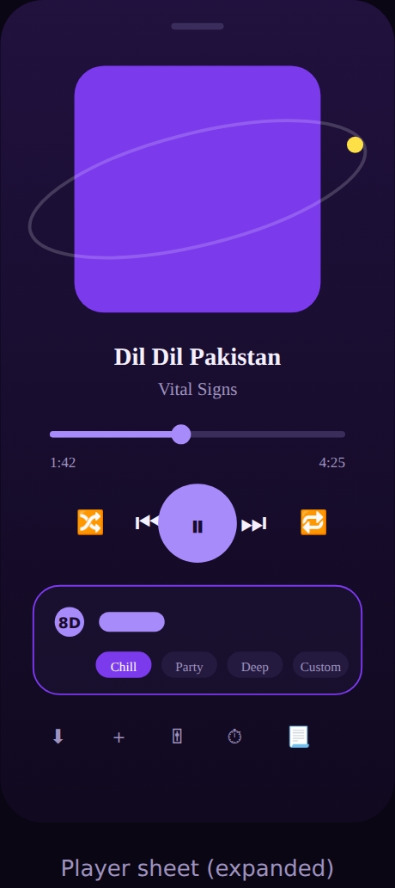
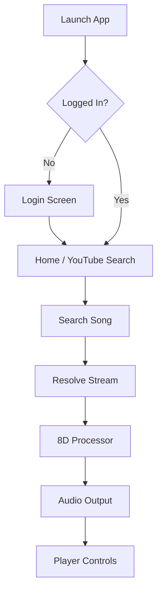

# Orbit — 8D Audio Experience

<p align="center">
  <a href="https://github.com/abdulhaseeb2k/Orbit/releases/latest"></a>
  
  
  <a href="LICENSE"></a>
  
</p>

Orbit is a free music player for **Android and Windows**, built around real-time
**8D spatial audio** — the sound orbits around your head, hence the name. It streams
from YouTube and Audius, downloads for offline play, and adds bass/treble control on
top. Both apps share one Kotlin core, so the effect sounds the same everywhere.

*(formerly VibeCaster)*

## ⬇️ Download

| Platform | File | Requirements |
|---|---|---|
| 📱 Android | [`orbit-android-v1.3.0.apk`](https://github.com/abdulhaseeb2k/Orbit/releases/latest) | Android 12+ · sideload (enable "Install unknown apps") |
| 🖥️ Windows | [`orbit-desktop-v1.3.0.msi`](https://github.com/abdulhaseeb2k/Orbit/releases/latest) | Windows 10/11 · ffmpeg + yt-dlp bundled, nothing to install |

All downloads also live on **[abdulhaseeb2k.github.io](https://abdulhaseeb2k.github.io)**.
It is completely free — no ads, no subscription, no account required.

> 💬 **Found a bug or want a feature?** Open an
> [issue](https://github.com/abdulhaseeb2k/Orbit/issues) — suggestions genuinely get built.

## 📸 Screenshots

<p align="center">
  
</p>

<p align="center">
  &nbsp;
  &nbsp;
  &nbsp;
  
</p>

> ℹ️ These are the design previews the apps were built from — the shipped UI
> follows them closely. Real device captures are on the way.

## 🚀 Features

- **8D Audio Engine**: Real-time spatial audio rotation with adjustable speed and depth.
- **Cross-device Sync (optional)**: Sign in with Google or email — playlists and history sync between phone and desktop, with auto-download on every device. Works 100% without an account too.
- **YouTube Integration**: Search and stream songs directly (personal use only — see note below).
- **Offline Mode**: Download your favorite tracks for offline playback.
- **Equalizer**: Dedicated Bass and Treble controls.
- **Modern UI**: Material 3 design with dynamic "Vibe" palettes.
- **Sleep Timer**: Automatically stop music after a set duration.
- **Lyrics Support**: Integrated lyrics fetching for most tracks.

## 🏗️ Project Structure (multi-module)

```text
core/                   # SHARED pure-JVM logic — used by BOTH apps
│   └── com/vibecaster/
│       ├── data/Track.kt          # Track model + matchKey() identity
│       └── youtube/YouTubeResolver.kt  # NewPipe search/resolve
├── app/                # Android app (Compose + Media3/ExoPlayer)
└── desktop/            # Windows/Mac/Linux app (Compose for Desktop)
    └── com/vibecaster/desktop/
        ├── Main.kt            # window, search UI, controls
        ├── DesktopPlayer.kt   # ffmpeg → PCM → DSP → speakers
        └── Dsp.kt             # 8D + tone EQ (same math as Android's audio/)
```

RULE: `core/` must never import `android.*` — that's what keeps it shareable
(and iOS-ready via Kotlin Multiplatform later).

## 🖥️ Desktop App

Requirements: **ffmpeg** on PATH (`winget install --id Gyan.FFmpeg`, then
restart the terminal/app).

```powershell
.\gradlew.bat :desktop:run          # run the desktop app
.\gradlew.bat :desktop:packageMsi   # build a Windows installer (optional)
```

Search by song name or paste a YouTube link, click a result to play. The 8D
rotation, bass/treble EQ, seek, and volume live in the right-hand panel. The
DSP is the identical math to the phone app (see `desktop/.../Dsp.kt` note).

## 📱 Android App Structure

```text
app/src/main/java/com/vibecaster/        # internal package name (cosmetic, kept)
├── data/               # Repositories for Local, YouTube, Audius, and Playlists
├── player/             # Media3 / ExoPlayer implementation and Audio Processors
├── ui/                 # Jetpack Compose Screens and Theme
│   ├── AppRoot.kt      # Main navigation and entry point
│   ├── PlayerScreen.kt # Full-screen 8D player
│   └── YouTubeScreen.kt# YouTube search and discovery
├── youtube/            # YouTube stream resolution (NewPipe Extractor)
└── MainViewModel.kt    # Central state management
```

> **Note on the rebrand:** the app is now fully **Orbit** — display name,
> icon, and `applicationId` (`com.orbit.music`). Installing Orbit does NOT
> replace an old VibeCaster install; uninstall that one manually. The internal
> code package stays `com.vibecaster` — it's invisible to users and renaming
> it buys nothing.

## 🔄 App Flow Diagram



## 🔑 Configuration (first build)

No API keys are stored in this repository. Before your first build:

1. Copy `secrets.properties.example` to `secrets.properties` in the repo root
   and fill in your own Firebase / Google OAuth values.
2. For the Android app, add your own `app/google-services.json` from the
   Firebase console.
3. For signed release builds, add the `RELEASE_*` entries to `local.properties`
   (see below).

All three files are gitignored. Sync is optional — both apps run fully offline
without any of them.

If you enable sync on your own Firebase project, deploy the access rules too —
`firestore.rules` in this repo restricts every document to its owner:

```bash
firebase deploy --only firestore:rules
```

## 🛠️ Installation & Build

### Requirements
- Android Studio Ladybug or newer
- Android SDK: `minSdk 31` (Android 12+), `compileSdk 37`
- Java 17

### How to Build a Signed Release
Signing credentials are **not** stored in the repo. Add them to your
`local.properties` (gitignored):

```properties
RELEASE_STORE_PASSWORD=...
RELEASE_KEY_ALIAS=...
RELEASE_KEY_PASSWORD=...
```

Then run `./gradlew assembleRelease` — the APK lands in
`app/build/outputs/apk/release/`. Your `release.keystore` stays on your own
machine and is gitignored — it is not part of this repository. Anyone building
from source should generate their own signing key.

Release builds now run R8 (`isMinifyEnabled = true` + resource shrinking) with
keep rules for NewPipeExtractor/Rhino in `app/proguard-rules.pro`. **Test the
first minified release build**; if anything breaks at runtime, flip the two
flags back to `false` in `app/build.gradle.kts`.

## ⚠️ Known Issues & Fixes

### YouTube Resolve Failed (NoSuchMethodError)
If you encounter a `NoSuchMethodError` related to `URLDecoder.decode`:
1. Ensure **Core Library Desugaring** is enabled in `build.gradle.kts`.
2. The project uses `desugar_jdk_libs_nio` to backport Java 11 APIs used by the NewPipe Extractor.

### Distribution
YouTube stream extraction is against YouTube's Terms of Service — this app is
for **personal use / sideloading via GitHub Releases only** and must never be
published to the Play Store in this form.

## 📄 License

Released under the [GNU General Public License v3.0](LICENSE).

Orbit links [NewPipeExtractor](https://github.com/TeamNewPipe/NewPipeExtractor),
which is GPL-3.0, so the combined work must be GPL-3.0 as well — a permissive
licence such as MIT is not available here. Packaged desktop builds also bundle
ffmpeg and yt-dlp, which keep their own licences; neither binary is stored in
this repository (they are fetched at build time).

---
*Built with ❤️ for the 8D Music Community.*
